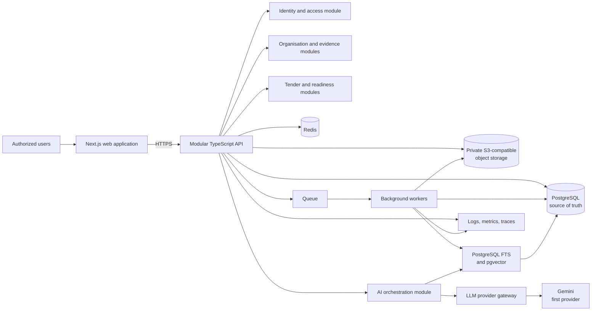
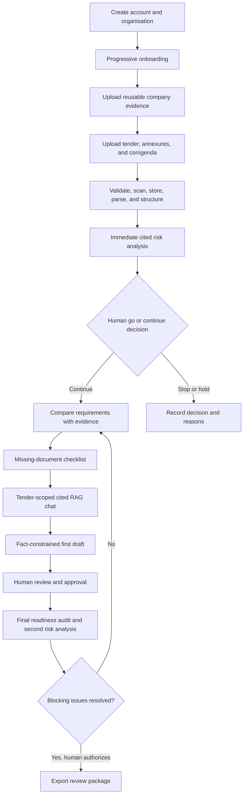

# Architecture

## Status and constraints

This document records the approved target direction through the Phase 3 private
reusable company-document vault.

The initial system is a TypeScript monorepo and modular monolith:

- Next.js web application;
- modular NestJS API using its Fastify adapter;
- BullMQ queue-backed background worker processes;
- PostgreSQL as the source of truth;
- private S3-compatible object storage;
- Redis for ephemeral coordination, cache, and queue support;
- PostgreSQL full-text search and pgvector for initial retrieval;
- provider-neutral LLM gateway, with Gemini as the first provider;
- Prisma ORM with the PostgreSQL driver adapter and versioned migrations;
- Zod environment and contract validation;
- Pino structured logging;
- OpenAPI, metrics, distributed tracing, automated tests, and CI.

Metrics and distributed tracing instrumentation remain a later infrastructure phase;
the module boundary and structured logging foundation exist now.

## High-level architecture

## End-to-end workflow

## Module boundaries

Planned business modules include identity and access, organisations, company
evidence, tender ingestion, tender analysis, eligibility, retrieval, drafting,
review and approval, readiness audit, export, and platform administration.

Each module owns its policies and persistence access. Transport handlers validate
input and delegate to application services. Domain logic does not import framework,
database, object-storage, queue, or LLM SDK details. Cross-module communication uses
explicit interfaces and domain events where appropriate.

Phase 1B implements identity/access and organisation modules. Controllers validate
Zod contracts, application services coordinate Prisma transactions and delivery
ports, and framework-independent role policy remains in `@tender/domain`. Global
guards enforce Redis rate limits, CSRF, authentication, then tenant permissions.
PostgreSQL stores users, session digests, organisations, memberships, invitations,
password reset digests, onboarding progress shells, company profile shells, and
audits.

Phase 2 adds an onboarding module without introducing a new service boundary. Eight
step-specific Zod contracts validate autosaves. The application service translates
validated values into typed profile-value columns, structured annual-turnover rows,
structured document-readiness rows, and per-user onboarding progress. Profile
completion, conditional requirements, display mode, and recommendations remain
framework-independent domain policies. No company document binary is accepted in
this phase; `evidence_document_id` is a nullable future reference only.

## Data ownership

Phase 3 adds a company-evidence module and worker consumer. The API validates
organisation permission and metadata, creates immutable version metadata, and signs
a five-minute direct upload into an opaque `quarantine/` key. The worker verifies
size, SHA-256, detected MIME and extension, then sends bytes through a
provider-neutral `MalwareScanner` port. The local adapter speaks ClamAV's INSTREAM
protocol. Only clean files move to an opaque `approved/` key and become
downloadable through a newly authorised one-minute URL. Neither API nor worker
writes document binaries to local disk.

BullMQ jobs contain only organisation and opaque record identifiers. PostgreSQL
remains authoritative for upload sessions, versions, processing, verification,
access, retention, and deletion state.

Phase 4 adds the tender-ingestion module within the modular monolith. A source
adapter port normalizes manual uploads, curated demonstration data, and controlled
administrator imports while preserving provenance. Tender workspaces, immutable
versions, source documents, corrigenda, and jobs are organisation-owned PostgreSQL
records. Binaries use opaque `tender-quarantine/` and `tender-approved/` keys and
the Phase 3 scanner. PostgreSQL remains the job-status authority; server-sent
events read that status and close at terminal states.

The worker performs bounded reads, checksum and content-type checks, metadata-only
ZIP inspection, malware scanning, and fail-closed promotion. Phase 4 performs no
text extraction, requirement parsing, analysis, or AI work.

PostgreSQL stores authoritative users, memberships, metadata, workflow state,
requirements, findings, citations, evidence links, reviews, audit records, and
export manifests. Object storage holds encrypted private binaries and derived
artifacts referenced by immutable identifiers. Redis is never an authoritative
record. Search indexes are derived and rebuildable.

Every customer-owned record carries an organisation boundary. File and search access
must be authorized before retrieval. Deletion and retention workflows must cover
database rows, objects, derived text, embeddings, caches, and exports.

## Asynchronous processing

Upload validation, malware scanning, text extraction, OCR where approved, chunking,
embedding, analysis, and export generation are background jobs. Jobs must be
idempotent, retry safely, expose failure states, use a dead-letter strategy, and
preserve correlation and audit identifiers.

## AI boundary

The LLM gateway normalizes model requests, structured responses, safety policy,
timeouts, retries, usage telemetry, and provider selection. Gemini is the first
provider adapter, not a domain dependency. Retrieval and policy enforcement happen
in application-controlled code. Provider output is untrusted until schema
validation, citation verification, and relevant human review.

## API and observability

The HTTP API is contract-first or contract-synchronized through OpenAPI. Errors use
stable machine-readable codes and correlation IDs.

Logs are structured and redacted. Metrics cover request health, queue lag, job
failures, model latency and cost, retrieval quality signals, citation failures, and
security events. Traces connect web requests, API operations, jobs, storage, search,
and model calls without recording sensitive document content.

## Deployment direction

Deployments should promote immutable artifacts through isolated environments.
Phase 1A includes separate production Dockerfiles for the web, API, and worker, plus
Docker Compose for local PostgreSQL, Redis, and MinIO. Compose credentials are
provided only through a developer-owned `.env` file.

Infrastructure configuration, secrets management, backups, recovery objectives,
retention, and regional data requirements will be decided before production. These
are unresolved operational decisions, not completed capabilities.

See [Architecture Decision Records](adr/README.md) for accepted foundational
decisions.

## Phase 5 extraction pipeline

After `SOURCE_READY`, the API creates an organisation-scoped immutable extraction
run containing an exact source fingerprint and opaque identifiers only. The worker
reads approved private objects through bounded format adapters, normalises source
units and blocks, applies deterministic section and requirement rules, validates
citations, and commits results atomically before activating the run. Progress uses
bounded server-sent events with polling fallback. Parser and OCR contracts live in
the domain layer; no OCR adapter is configured, so scanned pages honestly report
`OCR_UNAVAILABLE`.

## Phase 6 early risk gate

The API fingerprints the exact active extraction and queues opaque identifiers. The
worker reloads tenant-scoped PostgreSQL records, applies versioned deterministic
rules, validates reused citations, and atomically activates the completed `EARLY`
report. Reviews and pursuit decisions are human-authored history records. A changed
extraction invalidates current risk state. See
[Early Tender-Risk Policy](RISK_POLICY.md).

## Phase 7 evidence comparison

Phase 7 adds an `eligibility` module and an opaque-ID BullMQ worker. The API
validates the current extraction, completed EARLY risk run, and human `CONTINUE`
decision before transactionally capturing relational company-evidence snapshots.
The worker reloads and re-authorises inputs, creates one conservative assessment
per cited requirement, validates evidence links, and atomically activates a
completed run. See [the comparison policy](COMPARISON_POLICY.md) and
[ADR 0010](adr/0010-immutable-controlled-evidence-assessments.md).
