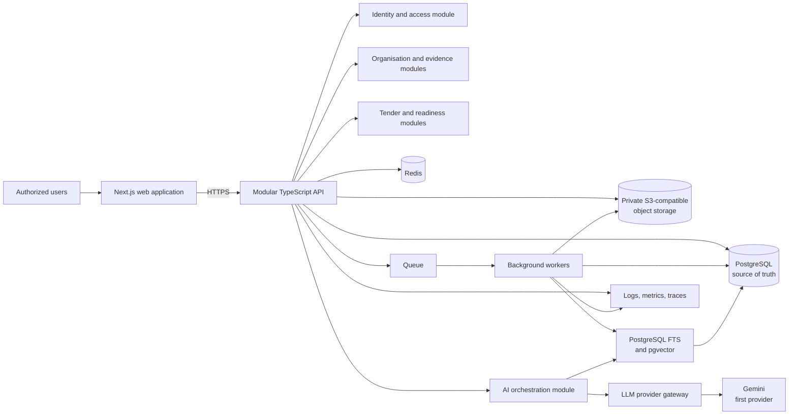
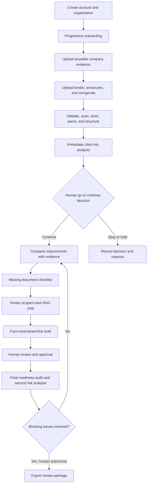

# Architecture

## Status and constraints

This document records the approved target direction and the Phase 1B identity and
organisation foundation.

The initial system is a TypeScript monorepo and modular monolith:

- Next.js web application;
- modular NestJS API using its Fastify adapter;
- BullMQ queue-backed background worker processes;
- PostgreSQL as the source of truth;
- private S3-compatible object storage;
- Redis for ephemeral coordination, cache, and queue support;
- PostgreSQL full-text search and pgvector for initial retrieval;
- provider-neutral LLM gateway, with Gemini as the first provider;
- Prisma ORM with the PostgreSQL driver adapter and versioned migrations;
- Zod environment and contract validation;
- Pino structured logging;
- OpenAPI, metrics, distributed tracing, automated tests, and CI.

Metrics and distributed tracing instrumentation remain a later infrastructure phase;
the module boundary and structured logging foundation exist now.

## High-level architecture

## End-to-end workflow

## Module boundaries

Planned business modules include identity and access, organisations, company
evidence, tender ingestion, tender analysis, eligibility, retrieval, drafting,
review and approval, readiness audit, export, and platform administration.

Each module owns its policies and persistence access. Transport handlers validate
input and delegate to application services. Domain logic does not import framework,
database, object-storage, queue, or LLM SDK details. Cross-module communication uses
explicit interfaces and domain events where appropriate.

Phase 1B implements identity/access and organisation modules. Controllers validate
Zod contracts, application services coordinate Prisma transactions and delivery
ports, and framework-independent role policy remains in `@tender/domain`. Global
guards enforce Redis rate limits, CSRF, authentication, then tenant permissions.
PostgreSQL stores users, session digests, organisations, memberships, invitations,
password reset digests, onboarding progress shells, company profile shells, and
audits.

## Data ownership

PostgreSQL stores authoritative users, memberships, metadata, workflow state,
requirements, findings, citations, evidence links, reviews, audit records, and
export manifests. Object storage holds encrypted private binaries and derived
artifacts referenced by immutable identifiers. Redis is never an authoritative
record. Search indexes are derived and rebuildable.

Every customer-owned record carries an organisation boundary. File and search access
must be authorized before retrieval. Deletion and retention workflows must cover
database rows, objects, derived text, embeddings, caches, and exports.

## Asynchronous processing

Upload validation, malware scanning, text extraction, OCR where approved, chunking,
embedding, analysis, and export generation are background jobs. Jobs must be
idempotent, retry safely, expose failure states, use a dead-letter strategy, and
preserve correlation and audit identifiers.

## AI boundary

The LLM gateway normalizes model requests, structured responses, safety policy,
timeouts, retries, usage telemetry, and provider selection. Gemini is the first
provider adapter, not a domain dependency. Retrieval and policy enforcement happen
in application-controlled code. Provider output is untrusted until schema
validation, citation verification, and relevant human review.

## API and observability

The HTTP API is contract-first or contract-synchronized through OpenAPI. Errors use
stable machine-readable codes and correlation IDs.

Logs are structured and redacted. Metrics cover request health, queue lag, job
failures, model latency and cost, retrieval quality signals, citation failures, and
security events. Traces connect web requests, API operations, jobs, storage, search,
and model calls without recording sensitive document content.

## Deployment direction

Deployments should promote immutable artifacts through isolated environments.
Phase 1A includes separate production Dockerfiles for the web, API, and worker, plus
Docker Compose for local PostgreSQL, Redis, and MinIO. Compose credentials are
provided only through a developer-owned `.env` file.

Infrastructure configuration, secrets management, backups, recovery objectives,
retention, and regional data requirements will be decided before production. These
are unresolved operational decisions, not completed capabilities.

See [Architecture Decision Records](adr/README.md) for accepted foundational
decisions.
