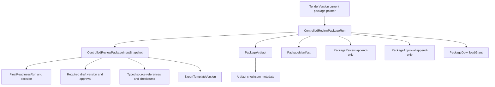
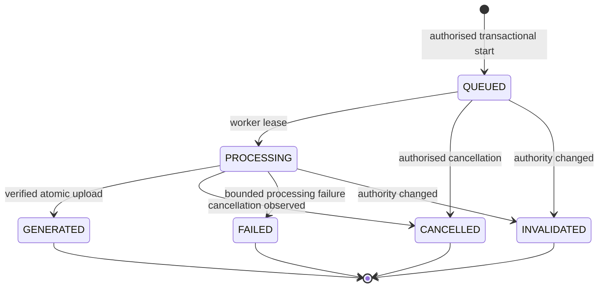
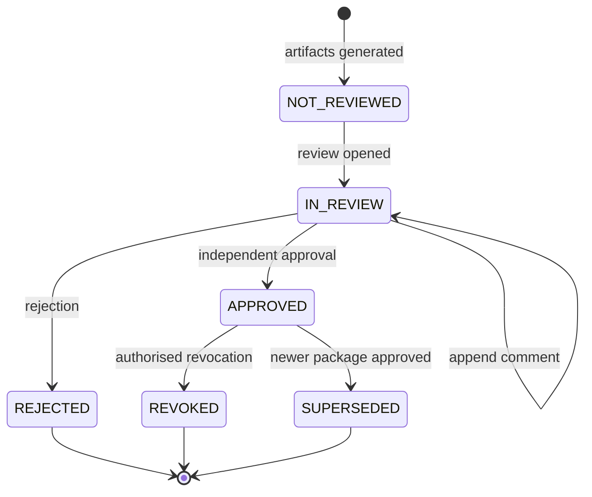
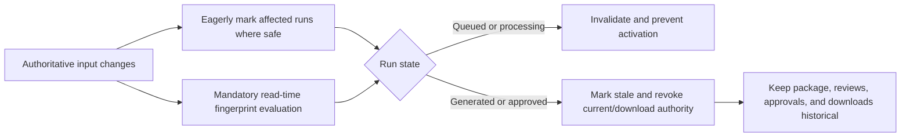
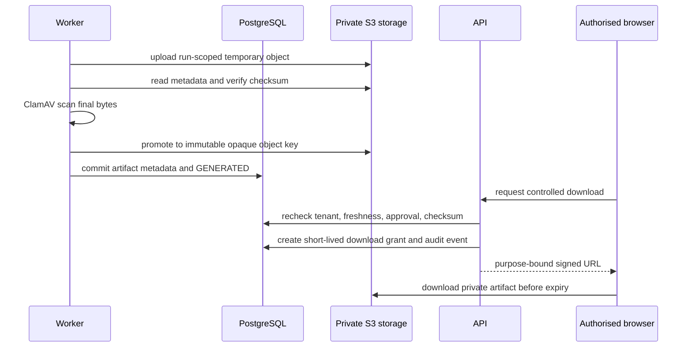

# Controlled Review-Package Export Policy

Policy version: `controlled-review-package-deterministic-v1`

Status: architecture is approved for incremental implementation. Domain policy,
shared contracts, and relational persistence are implemented; API, worker, renderer,
web, and release validation remain pending.

## Purpose and boundary

Phase 12 will create an immutable, tenant-scoped package for controlled human review
and authorised download after a current Phase 11 decision of
`PROCEED_TO_CONTROLLED_EXPORT_REVIEW`. Generation, review, approval for download,
download, and external submission are distinct actions. Phase 12 ends at controlled
download and implements no portal integration or submission.

The package is not approval to submit, legal advice, compliance or eligibility
certification, a completeness guarantee, or a bid-success prediction. The product
is independent and is not affiliated with GeM, CPPP, or a government authority.
V1 uses no LLM, RAG system, external AI provider, readiness score, risk score,
export score, or compliance score. It may copy authoritative approved content and
create deterministic structure, labels, indexes, warnings, identifiers, pagination,
and checksums; it may not create or rewrite material tender claims.

## Authority and preflight

A read-only preflight follows the existing organisation-and-tender route convention.
It reports bounded prerequisite, warning, review-blocker, and download-blocker codes,
the safe current identifiers, qualifying package template, and whether an eligible
independent approver exists. It is informational and race-prone. Start repeats every
check transactionally.

### Hard generation prerequisites

Start requires all of the following in the same organisation, tender, and current
tender version:

- authenticated active membership and explicit generation permission;
- the current completed, non-stale, non-invalidated `FinalReadinessRun`;
- its completed linked `FINAL_READINESS` risk run;
- its current unsuperseded `FinalReadinessDecision` with disposition
  `PROCEED_TO_CONTROLLED_EXPORT_REVIEW` and preserved role-at-decision evidence;
- the complete Phase 11 fingerprint still matching authoritative state;
- the exact approved `CONSOLIDATED_FIRST_DRAFT`, draft approval, input snapshot,
  source set, evidence snapshot, eligibility run, checklist run, and typed
  provenance pinned by Phase 11;
- every required binary source selected for inclusion remaining `READY`, checksum
  matching, privately stored, and malware-cleared;
- an active approved export-template version;
- object storage and queue readiness; and
- no other active package run for the same tender version and policy.

V1 includes no raw supporting binary by default, so an unavailable source that is
only referenced by a safe handle becomes a package warning when Phase 11 remains
fresh. A missing byte stream required to render the approved draft, an unsafe
selected object, an invalid checksum, or unavailable private storage is a hard
generation failure. Negative tender facts remain cited warnings or review blockers;
they are not technical failures merely because they are negative.

### Treatment after start

| Condition                                                             | Treatment                                                 |
| --------------------------------------------------------------------- | --------------------------------------------------------- |
| Upstream authority changes, checksum mismatch, unsafe required object | Invalidate in-progress generation; no artifact activation |
| Phase 11 warning or acknowledged limitation                           | Package warning copied with typed source handle           |
| Artifact/manifest mismatch, scan not clean, incomplete upload         | Review and download blocker                               |
| Generated but not independently approved                              | Download blocker                                          |
| Rejected, stale, invalidated, expired, revoked, or superseded package | New-link blocker; history remains readable                |

## Immutable ownership

The planned aggregate names follow existing run/snapshot conventions:

`ControlledReviewPackageRun` is the aggregate root and immutable generation attempt.
It owns one immutable input snapshot, generated artifact metadata, manifest, reviews,
approval history, and download-grant history. PostgreSQL remains authoritative;
object storage contains private artifact bytes only.

The package snapshot is separate from, and references, the Phase 11 snapshot. It
pins the exact Phase 11 run and decision, run fingerprint, draft/version/approval,
template version, selected source handles, original checksums, generation policy,
and package-content selection. It does not copy source or evidence bodies into JSON.
Relational child records preserve typed provenance. The final-risk output is
referenced through the completed Phase 11 run and included only as bounded,
authoritative findings in the review PDF.

Regeneration and retry create a new run, snapshot, object prefix, artifacts, and
idempotency key. No artifact is overwritten. A newly approved package supersedes
the previous current package atomically; old records and objects remain historical
under retention policy.

## Package contents v1

V1 produces one ZIP container. It contains exactly four regular files, has no nested
archive, and is limited to 100 MiB. Individual artifacts are limited to 50 MiB;
filenames are ASCII-safe and at most 120 bytes.

| Content                                            | V1                 | Authority and transformation                                                                                                  | Format / classification                           | Review and provenance                                      |
| -------------------------------------------------- | ------------------ | ----------------------------------------------------------------------------------------------------------------------------- | ------------------------------------------------- | ---------------------------------------------------------- |
| Review document                                    | Required           | Exact approved draft text plus deterministic cover, index, warnings, readiness/final-risk/checklist appendices; no paraphrase | PDF/A-compatible PDF where feasible; confidential | Full review required; every material item has typed handle |
| Manifest                                           | Required           | Server-created safe metadata only                                                                                             | UTF-8 JSON; confidential metadata                 | Schema validated; separately readable and embedded         |
| Checksums                                          | Required           | SHA-256 over final artifact bytes                                                                                             | UTF-8 `SHA256SUMS.txt`; confidential metadata     | Recomputed before activation and download issuance         |
| Provenance index                                   | Required           | Typed handles and safe locators; no source bodies or evidence values                                                          | UTF-8 JSON; confidential metadata                 | Every material review entry resolves within tenant scope   |
| Approved consolidated draft                        | Required logically | Rendered into the review PDF from the pinned immutable version                                                                | PDF content                                       | Exact version and approval recorded                        |
| Readiness, final-risk, checklist, evidence indexes | Required           | Deterministic selection and ordering of authoritative bounded records                                                         | PDF appendices plus manifest handles              | No generated substantive summary                           |
| Supporting binaries                                | Excluded from v1   | Referenced by safe handles only                                                                                               | None                                              | Avoids exporting active/private material unnecessarily     |
| Editable DOCX                                      | Deferred           | Would duplicate editable authority and needs an audited OOXML generator                                                       | Future increment                                  | Requires macro/external-relationship controls              |
| Separate PDFs                                      | Deferred           | ZIP review PDF is sufficient for v1                                                                                           | Future increment                                  | Requires explicit content policy                           |
| Signatures                                         | Excluded           | SHA-256 is integrity metadata, not a digital signature                                                                        | None                                              | No signing infrastructure is claimed                       |

The review PDF is limited to 2,000 pages. The snapshot captures at most 200 tender
documents, 5,000 typed provenance references, 2,000 readiness/risk/checklist rows,
and the existing maximum 40 draft sections. Exceeding a limit fails with a bounded
policy error before rendering.

V1 has no optional payload: each required item is emitted or generation fails.
Supporting binaries and signatures are explicitly excluded; DOCX, separate PDFs,
and configurable branding are deferred rather than silently added.

## Determinism and fingerprints

The server alone constructs canonical inputs. Ordered relational identifiers,
source hashes, the Phase 11 fingerprint and decision, draft and approval versions,
template version, selected content, policy versions, and renderer compatibility
version form the `inputFingerprint`. Organisation/tender selectors and the client
idempotency key scope replay; an equivalent request returns the existing run while
changed authority returns an idempotency conflict.

Phase 12 v1 locks `rendererCompatibilityVersion` to
`controlled-review-package-renderer-compatibility-v1`. It identifies the canonical
renderer-facing compatibility contract independently of a future renderer
implementation; it selects no library and makes no PDF/A conformance claim. Renderer
selection, dependency and licence review, and PDF/A selection remain pending.

The deterministic content model excludes run ID, generation time, signed-link
expiry, storage key, and transient service version. A canonical render timestamp is
captured once in the snapshot and used consistently. `contentFingerprint` hashes
the canonical logical package model before container serialization. Each
`PackageArtifact` stores SHA-256 over its final bytes. The manifest records those
checksums; the ZIP checksum is stored outside the ZIP to avoid recursion. Checksums
provide integrity, not signer identity.

## Export templates

Phase 12 requires separate `ExportTemplate` and immutable `ExportTemplateVersion`
concepts because draft templates control claim structure, not binary rendering.
V1 starts with a repository-owned approved system template selected by policy;
tenant-created template management is deferred.

Template versions contain bounded declarative layout data only: fixed headers and
footers, disclaimer version, typography tokens, page numbering, table-of-contents
rules, safe filename pattern, and optional plain-text organisation name. They allow
no scripts, macros, expressions, remote resources, HTML injection, embedded files,
active links, arbitrary fonts, or user-supplied object keys. Logos and arbitrary
organisation branding are deferred until image validation and approval exist.
A retired template cannot start a run but remains referenced by history.

## Lifecycle

Machine generation, human review, and freshness are separate dimensions:

- generation status: `QUEUED`, `PROCESSING`, `GENERATED`, `FAILED`, `CANCELLED`,
  `INVALIDATED`;
- review status: `NOT_REVIEWED`, `IN_REVIEW`, `APPROVED`, `REJECTED`, `REVOKED`,
  `SUPERSEDED`;
- freshness is calculated on every authoritative read and mutation, with an eager
  `staleAt` marker where safe.

`CANCEL_REQUESTED`, `STALE`, `EXPIRED`, and `SUPERSEDED` are not machine-generation
states: cancellation request is a timestamp, staleness is freshness state, expiry
belongs to download grants or retention, and supersession belongs to review/current
authority. Failed, cancelled, and invalidated runs are retryable only through a new
run. Generated or rejected packages use regeneration, also creating a new run.

Only a fresh `GENERATED` plus `APPROVED` current package may issue a download grant.
All states remain historically visible to authorised readers.

| Generation state | Entry authority                      | Next state                                        | Current/download                                  | Retry and worker behavior                                              |
| ---------------- | ------------------------------------ | ------------------------------------------------- | ------------------------------------------------- | ---------------------------------------------------------------------- |
| `QUEUED`         | Start transaction                    | `PROCESSING`, `CANCELLED`, `INVALIDATED`          | Active; never downloadable                        | Worker may lease once; duplicate delivery is idempotent                |
| `PROCESSING`     | Worker compare-and-set lease         | `GENERATED`, `FAILED`, `CANCELLED`, `INVALIDATED` | Active; never downloadable                        | Same run is not retried; cancellation is checked between bounded steps |
| `GENERATED`      | Worker after verified promotion      | Terminal generation state                         | Candidate only; downloadable after fresh approval | Regeneration creates a new run; worker performs no more mutation       |
| `FAILED`         | Worker with bounded failure code     | Terminal                                          | Not current or downloadable                       | Authorised retry creates a new run                                     |
| `CANCELLED`      | Worker/API acknowledges cancellation | Terminal                                          | Not current or downloadable                       | Authorised retry creates a new run; temporary bytes are removed        |
| `INVALIDATED`    | Freshness check or worker            | Terminal                                          | Not current or downloadable                       | Only a fresh new run may proceed                                       |

| Review state   | Entry authority                               | Next state                          | Current/download                                   | Historical behavior                        |
| -------------- | --------------------------------------------- | ----------------------------------- | -------------------------------------------------- | ------------------------------------------ |
| `NOT_REVIEWED` | Successful generation                         | `IN_REVIEW`                         | Candidate; no download                             | Readable                                   |
| `IN_REVIEW`    | Authorised reviewer                           | `IN_REVIEW`, `APPROVED`, `REJECTED` | Candidate; no download                             | Comments append, never overwrite           |
| `APPROVED`     | Independent authorised approver               | `REVOKED`, `SUPERSEDED`             | Becomes current atomically; fresh download allowed | Approval remains attributable              |
| `REJECTED`     | Authorised approver with rationale            | Terminal                            | Not current or downloadable                        | Correction requires regeneration           |
| `REVOKED`      | Owner/Admin with rationale or stale authority | Terminal                            | Current pointer cleared; no new links              | Prior grants/downloads remain attributable |
| `SUPERSEDED`   | Approval of a newer run                       | Terminal                            | No longer current; no new links                    | Fully readable                             |

## Human control and separation of duties

Package reviews are append-only and use `expectedReviewVersion`. Approval/rejection
is append-only and uses the server-issued input/content fingerprint token and current
review version. Rejection requires rationale and a new generation run for corrected
bytes; generated artifacts never mutate in place.

The package approver must be `OWNER`, `ADMIN`, or `REVIEWER` with explicit approval
permission and must differ from the package requester and approved-draft creator.
The Phase 11 decision actor may approve when those conditions hold. No additional
Owner/Admin countersign is required in v1. The approver may also have reviewed the
package. Organisations without an eligible second actor fail closed without a
single-user bypass. `PLATFORM_ADMIN` has no implicit tenant authority.

## Permission matrix

Planned explicit permissions use the existing roles:

| Operation                                     | Owner | Admin | Tender Executive | Consultant | Reviewer |
| --------------------------------------------- | :---: | :---: | :--------------: | :--------: | :------: |
| Preflight/read history/details/manifest/audit |  Yes  |  Yes  |       Yes        |    Yes     |   Yes    |
| Start, cancel, retry/regenerate               |  Yes  |  Yes  |       Yes        |    Yes     |    No    |
| Append package review                         |  Yes  |  Yes  |        No        |     No     |   Yes    |
| Approve or reject for controlled download     |  Yes  |  Yes  |        No        |     No     |   Yes    |
| Request download grant/download               |  Yes  |  Yes  |       Yes        |     No     |   Yes    |
| Revoke an approved package                    |  Yes  |  Yes  |        No        |     No     |    No    |

Every operation also requires active same-tenant membership and its dedicated
permission. Read permissions do not imply source-body access. UI visibility is not
authorization.

## Freshness and invalidation

Changes to tender/version/source set, extraction, EARLY risk/decision, eligibility,
checklist, evidence, draft/version/approval, Phase 11 run/final-risk/decision,
template, content policy, or selected source availability affect the fingerprint.
They block new generation from old authority, invalidate work in progress, make a
generated package stale, revoke effective download approval, and prevent new links.
Already downloaded bytes cannot be recalled; their package, grant, actor, checksum,
and historical authority remain auditable.

Membership or role changes do not rewrite historical role-at-action evidence. They
immediately affect new reviews, approvals, revocations, and download grants. A role
change alone does not change artifact bytes, but loss of permission blocks future
access and link issuance.

Final generation, approval, revocation, and download-grant transactions recheck
current pointers, statuses, snapshot fingerprint, artifact checksums, malware state,
permissions, and applicable separation of duties. Eager invalidation never replaces
read-time checks.

## Idempotency and concurrency

- Start keys are unique within organisation, tender, and operation.
- Equivalent replay returns the same run; the same key with changed canonical input
  returns `CONTROLLED_PACKAGE_IDEMPOTENCY_CONFLICT`.
- A partial unique constraint permits one active `QUEUED`/`PROCESSING` run for a
  tender version and policy.
- Serializable start with bounded retry creates run and snapshot before enqueue.
- Queue messages contain only organisation ID, tender ID, package run ID, and
  request ID.
- Workers acquire/verify the existing run, tolerate duplicate delivery, write to a
  run-specific temporary object, verify size/checksum/scan, promote once, and
  activate only through compare-and-set state.
- Review and approval versions prevent lost updates and duplicate approvals.
- Download issuance locks or safely rechecks current approval and freshness; each
  request creates a distinct grant record.

## API and migration direction

Routes will remain below the existing
`organisations/:organisationId/tenders/:tenderId` controller boundary. Planned route
families are `controlled-review-packages/preflight`,
`controlled-review-packages`, version-scoped current/history reads,
`controlled-review-packages/:runId`, append-only `reviews` and `decisions`,
`revocation`, and artifact-scoped `download-grants`. Exact verbs and schemas are
contract work for the API implementation; all selectors are server-validated and no
route accepts an authority-bearing fingerprint computed by the browser.

The versioned migration implements the aggregate, relational snapshot children,
artifacts, manifest, reviews, approval, grants, idempotency, current pointer, and
partial active-run uniqueness. Deployment must support both upgrade and fresh
databases and preserve recovery for a future database commit followed by queue or
storage failure.

The implemented migration is forward-only under the repository's Prisma convention.
Rollback requires stopping Phase 12 writers, preserving immutable rows and private
object references, deploying compatible application code, and applying a separately
reviewed recovery migration; an existing migration must never be edited after
release.

## Private storage and controlled download

Use the existing private S3-compatible bucket architecture with an export-specific,
tenant/run-scoped opaque prefix. Public access and permanent URLs remain prohibited;
public responses expose artifact IDs, never object keys. V1 uses a purpose-bound
signed URL with the existing one-minute default. It is reusable only until expiry
because S3 presigning is not inherently single-use; each issuance is authorised and
audited. A future single-use requirement needs an application streaming/proxy
design, not a claim over reusable presigned URLs.

Responses set exact MIME and safe attachment `Content-Disposition`. Signed URLs,
cookies, credentials, object keys, and source bodies are excluded from logs and
generic audit metadata. Stale, rejected, invalidated, revoked, superseded, or
unapproved packages cannot obtain new grants. Storage access logs are needed to
observe completion; the API can reliably audit issuance but not claim download
completion from a direct signed URL.

## Manifest and provenance

`manifest.json` is schema-versioned, canonical UTF-8 JSON, embedded in the ZIP and
available through a separately authorised API representation. It is checksum
protected but not digitally signed. It contains only bounded safe metadata:

- schema, generation-policy, content-policy, and renderer-compatibility versions;
- package, organisation, tender, tender-version, Phase 11 run/decision, approved
  draft/version/approval, and template-version identifiers;
- canonical generation timestamp and content fingerprint;
- artifact logical names, MIME types, byte sizes, SHA-256 values, and classification;
- typed source-reference handles and original source checksums;
- bounded warning codes and readiness/final-risk/checklist references;
- review and approval record identifiers when exported through the API.

It excludes unrestricted source bodies, evidence values, draft text, prompts,
credentials, signed URLs, storage keys, session data, and internal errors. The
embedded manifest represents generation-time authority; later review/approval is
available through the API rather than rewriting the immutable ZIP.

## Safe audit and error model

Planned append-oriented audit events cover preflight outcome, requested, started,
completed, failed, cancellation, retry/regeneration, reviewed, approved, rejected,
invalidated, revoked, superseded, download grant issued, and download observed when
storage telemetry supports it. Metadata is limited to actor, role at action,
organisation, tender, run/artifact/grant IDs, safe result code, versions, counts,
timestamp, and request ID.

Stable public codes include:

- `CONTROLLED_PACKAGE_PREREQUISITES_NOT_CURRENT`
- `CONTROLLED_PACKAGE_PROCEED_DECISION_REQUIRED`
- `CONTROLLED_PACKAGE_ALREADY_ACTIVE`
- `CONTROLLED_PACKAGE_IDEMPOTENCY_CONFLICT`
- `CONTROLLED_PACKAGE_STALE`
- `CONTROLLED_PACKAGE_INVALIDATED`
- `CONTROLLED_PACKAGE_NOT_GENERATED`
- `CONTROLLED_PACKAGE_REVIEW_REQUIRED`
- `CONTROLLED_PACKAGE_APPROVAL_BLOCKED`
- `CONTROLLED_PACKAGE_SEPARATION_OF_DUTIES_REQUIRED`
- `CONTROLLED_PACKAGE_REVOKED`
- `CONTROLLED_PACKAGE_DOWNLOAD_EXPIRED`
- `CONTROLLED_PACKAGE_DOWNLOAD_NOT_AUTHORISED`
- `CONTROLLED_PACKAGE_ARTIFACT_UNAVAILABLE`
- `CONTROLLED_PACKAGE_NOT_RETRYABLE`
- `CONTROLLED_PACKAGE_UNSAFE_SOURCE`
- `CONTROLLED_PACKAGE_SIZE_LIMIT_EXCEEDED`
- `CONTROLLED_PACKAGE_DOCUMENT_LIMIT_EXCEEDED`

Messages are bounded and reveal no renderer, parser, database, queue, storage, or
antivirus detail. Request IDs support operational correlation.

## Retention and cleanup

Database run, snapshot, manifest, review, approval, grant, checksum, and audit rows
are retained as immutable audit history under the organisation retention policy.
An exact production duration remains a launch-blocking legal/operations decision;
implementation must not invent one.

Temporary local files are created in a per-job restricted directory and removed on
success, failure, cancellation, and process recovery. Temporary object uploads have
a short lifecycle rule and reconciliation job. Failed and cancelled runs retain
database history but no promoted artifact. Stale, rejected, revoked, and superseded
artifacts remain private until the approved retention schedule permits deletion;
metadata and audit evidence survive object deletion. Signed grants expire after one
minute. Only Owner/Admin revocation is in v1; destructive historical deletion is
deferred until a reviewed cascade and legal-hold policy exist.

## Explicit exclusions

Phase 12 excludes scraping, portal login, CAPTCHA handling, procurement-portal
browser automation, submission, portal form filling, reverse-auction automation,
digital-signature application, external email delivery, public share links, legal
advice, certifications, guarantees, autonomous approval, scores, and AI rewriting.

## Implementation sequence

| Task                          | Scope and prerequisites                                                                                                                               | Likely locations                                             | Required tests and risks                                                                                                             | Commit / exclusions                                                                        |
| ----------------------------- | ----------------------------------------------------------------------------------------------------------------------------------------------------- | ------------------------------------------------------------ | ------------------------------------------------------------------------------------------------------------------------------------ | ------------------------------------------------------------------------------------------ |
| Domain, contracts, database   | After ADR review: pure policies, permissions, strict schemas, aggregate, constraints and reversible migration                                         | `packages/domain`, `packages/contracts`, `packages/database` | Policy matrices, schema rejection, uniqueness, upgraded/fresh migration; risk: mutable authority in JSON                             | `feat(phase-12): add controlled package domain and persistence`; no endpoint, worker or UI |
| API lifecycle                 | After persistence: preflight, serializable start, reads, freshness, cancellation, regeneration, review, decisions, revocation and grant authorisation | `apps/api` plus OpenAPI tests                                | Tenant/role selectors, idempotency, races, separation, stale approval/link; risk: missed transactional recheck                       | `feat(api): add controlled package lifecycle`; no rendering or submission                  |
| Worker ZIP/manifest           | After API contract: canonical model, names, manifest, checksums, bounded ZIP, scan and atomic upload                                                  | `apps/worker`                                                | Golden bytes, duplicate delivery, cancellation, limits, scan/storage failure and cleanup; risk: archive/parser denial of service     | `feat(worker): generate controlled package artifacts`; no DOCX or substantive generation   |
| PDF renderer                  | After dependency/licence/security decision: exact draft rendering and passive deterministic appendices                                                | `apps/worker` renderer adapter                               | Cross-platform structure, page/size bounds, active-content and network inspection; risk: nondeterminism and renderer vulnerabilities | `feat(worker): render controlled review PDF`; no HTML execution, AI rewriting or DOCX      |
| Web stage                     | After stable API: URL-addressed preflight, history, detail, review, decision, revocation and download                                                 | `apps/web`                                                   | Behavioural, permission visibility, keyboard/screen reader and four viewport tests; risk: UI authority claims                        | `feat(web): add controlled package review`; no submission or browser fingerprint           |
| Integration/security          | After all layers: adversarial selectors/files, concurrent actions, stale links, reconciliation and redaction                                          | Cross-layer test suites and security docs                    | Full threat corpus, audit canaries, real ClamAV/S3/Redis/PostgreSQL paths; risk: environment-only gaps                               | `test(phase-12): harden controlled package workflow`; no feature expansion                 |
| Real-stack/browser validation | After automated gates: upgraded/fresh deploy, actual byte inspection, private browser download, responsive workflow                                   | Validation evidence; code only for genuine defects           | All quality gates, migrations, Docker health, artifact inspection and browser smoke; risk: renderer/platform drift                   | Focused fix commits only; no merge, portal action or unsupported claim                     |

ZIP/manifest and PDF generation are separate worker prompts because PDF introduces
a new dependency and active-content/rendering attack surface. DOCX remains deferred
and must not be bundled into either prompt.

For every implementation task, run focused tests plus `pnpm format:check`,
`pnpm lint`, `pnpm typecheck`, `pnpm test`, `pnpm build`, migration validation when
applicable, and `git diff --check`. Production code must continue to exclude Phase 12
submission behavior.

## Dependency discovery

Existing repository capabilities:

- Node `crypto` supplies SHA-256;
- AWS SDK S3 clients and presigner supply private object operations and short-lived
  links;
- `file-type` supplies content sniffing;
- `fflate` supplies bounded ZIP primitives already used for ZIP inspection;
- existing filename policy and parser utilities provide a starting point for safe
  names but require export-specific tests;
- ClamAV integration scans bounded byte streams and fails closed;
- `pdfjs-dist` parses PDFs but does not generate them.

No existing dependency generates PDF or DOCX. A future PDF dependency must support
deterministic server-side output, no JavaScript/embedded-file generation, bounded
memory, maintained releases, compatible licence, and cross-platform Node builds.
A DOCX dependency is unnecessary in v1. Dependency review must compare a
repository-native minimal PDF writer against a maintained library and document
licence and transitive-security consequences; popularity alone is insufficient.

## Open decisions before production launch

- legal/operational database and object retention duration;
- whether production requires application-streamed single-use downloads rather
  than one-minute reusable presigned URLs;
- PDF/A conformance level and approved renderer dependency;
- whether storage access logs can reliably establish download completion; and
- future organisation-branding approval and asset-validation policy.

These do not prevent domain/contract/database planning but must be resolved before
production download is enabled.
